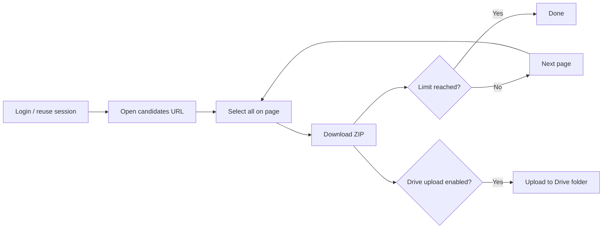

# Instahyre bulk CV download

Playwright automation for **Instahyre employer portal**: login, session reuse, and resume download **page by page** (~30 candidates per page).

Download flow: **View profile → Download resume** per candidate (primary), with bulk ZIP fallback.

See also: **[docs/INSTAHYRE.md](../docs/INSTAHYRE.md)** · **[docs/VM-SETUP.md](../docs/VM-SETUP.md)**

Used in two ways:

1. **Standalone CLI** — run from terminal for local ZIP downloads
2. **Via portal** — `fetch-cvs-server` spawns this module when you click **Fetch CVs & Rank** on the Instahyre tab

---

## How it works

For each page until `DOWNLOAD_LIMIT` total resumes is reached:

1. Select **all 30** on a full page, or **only the remaining count** on the last batch (e.g. limit 10 → selects 10 checkboxes, not the whole page)
2. Click **Download resumes**
3. In the modal: check **Zip file of resumes** → **Download**
4. Save ZIP to `LOCAL_SAVE_DIR`
5. Click **Next** page only if more CVs are still needed



**Exact limit:** the last batch selects only the remaining candidates (via individual checkboxes). A limit of 10 downloads exactly 10 CVs on page 1 — not a full page of 30.

After first login, the session is saved to `sessions/storageState.json` for reuse.

---

## Setup

### Prerequisites

- Node.js 18+
- Instahyre employer account
- Google OAuth credentials (only if uploading to Drive)

### Install

```bash
cd bulk-download-instahyre
npm install
```

Playwright Chromium is installed via `postinstall`.

### Environment

**All config lives in the repo root** — not in `bulk-download-instahyre/.env`.

```bash
# from ats-perfect-ventures/
cp .env.example .env.local
```

Edit `.env.local` (or `.env`). Both files are loaded; `.env.local` wins.

#### Required

| Variable | Description |
|----------|-------------|
| `INSTAHYRE_EMAIL` | Employer login email |
| `INSTAHYRE_PASSWORD` | Password |
| `INSTAHYRE_CANDIDATES_URL` | Candidates list URL (for standalone runs) |
| `DOWNLOAD_LIMIT` | Target resume count (e.g. `60`) |
| `HEADLESS` | `false` recommended for first login |

#### Paths

| Variable | Description |
|----------|-------------|
| `LOCAL_SAVE_DIR` | Folder for ZIP files |
| `INSTAHYRE_LOCAL_SAVE_DIR` | Alias for `LOCAL_SAVE_DIR` |
| `SESSION_DIR` | Session folder (default `sessions`) |
| `INSTAHYRE_SESSION_DIR` | Alias for `SESSION_DIR` |

#### Google Drive (optional)

| Variable | Description |
|----------|-------------|
| `UPLOAD_TO_DRIVE_AFTER_DOWNLOAD` | `true` to upload after download |
| `GOOGLE_DRIVE_FOLDER_ID` | Target Drive folder ID |
| `GOOGLE_AUTH_MODE` | `oauth` or `service_account` |
| `GOOGLE_OAUTH_CLIENT_ID` / `GOOGLE_OAUTH_CLIENT_SECRET` | OAuth credentials |
| `GOOGLE_OAUTH_TOKEN_FILE` | Token after `npm run google-oauth-setup` |

When triggered from the **portal**, `fetch-cvs-server` overrides `INSTAHYRE_CANDIDATES_URL`, `DOWNLOAD_LIMIT`, and `GOOGLE_DRIVE_FOLDER_ID`.

#### Example `.env.local` snippet

```env
INSTAHYRE_EMAIL=your@email.com
INSTAHYRE_PASSWORD=yourpassword
INSTAHYRE_CANDIDATES_URL=https://www.instahyre.com/employer/candidates/350351/0/
DOWNLOAD_LIMIT=60
LOCAL_SAVE_DIR=D:\Resumes\Instahyre
HEADLESS=false
```

---

## Commands

Run from **`bulk-download-instahyre/`**:

| Script | Description |
|--------|-------------|
| `npm run download` | Bulk download from `INSTAHYRE_CANDIDATES_URL` |
| `npm run google-oauth-setup` | One-time Google Drive OAuth (CLI uploads) |
| `npm run upload-extracted` | Upload extracted PDFs from local folder to Drive |
| `npm run build` | Compile TypeScript |

Run from **repo root**:

```bash
npm run bulk-download-instahyre
```

---

## First run

```bash
# 1. Set INSTAHYRE_EMAIL, INSTAHYRE_PASSWORD, INSTAHYRE_CANDIDATES_URL in .env.local

# 2. Download (visible browser on first run — completes login if needed)
cd bulk-download-instahyre
npm run download
```

Session is saved automatically to `sessions/storageState.json` for subsequent runs.

---

## Output

Terminal example:

```text
[page 1] status=downloaded | count=30 | local=D:\...\instahyre-page-01-resumes.zip
[page 2] status=downloaded | count=30 | local=D:\...\instahyre-page-02-resumes.zip

--- Summary ---
Target limit: 60
Resumes downloaded: 60
Local folder: D:\Resumes\Instahyre
```

ZIP files land in `LOCAL_SAVE_DIR`. Use `npm run upload-extracted` to push individual PDFs to Drive if needed.

---

## Portal integration

When you use **Upload Resumes → Instahyre** in the portal:

1. `fetch-cvs-server` must be running (`npm run fetch-cvs-server` from repo root).
2. Google Drive must be connected in the portal header.
3. The JD must have a Drive folder.
4. The server runs `npm run download` with:
   - `INSTAHYRE_CANDIDATES_URL` = URL you pasted
   - `DOWNLOAD_LIMIT` = count you entered
   - `GOOGLE_DRIVE_FOLDER_ID` = JD's `instahyre` subfolder
   - `UPLOAD_TO_DRIVE_AFTER_DOWNLOAD=true`

After download completes, the portal ranks CVs from that Drive folder.

---

## Project structure

```
bulk-download-instahyre/
├── src/
│   ├── auth/login.ts              # Login + open candidates page
│   ├── instahyre/
│   │   ├── selectors.ts           # UI selectors
│   │   ├── downloadPageBatch.ts   # One page: select all → ZIP download
│   │   └── downloadCvs.ts         # Pagination loop
│   ├── browser/
│   ├── session/
│   ├── drive/                     # Optional Drive upload
│   └── scripts/download.ts        # CLI entry point
├── sessions/                      # storageState, downloads (gitignored)
├── logs/
└── package.json
```

---

## Troubleshooting

### Missing credentials

Set `INSTAHYRE_EMAIL` and `INSTAHYRE_PASSWORD` in **repo root** `.env.local`.

### Login fails / 2FA

Use `HEADLESS=false`, complete login manually in the browser window, then re-run.

### Wrong page or empty download

Verify `INSTAHYRE_CANDIDATES_URL` points to the employer candidates list (not a public job page).

### Fewer CVs than limit

If the search has fewer candidates than `DOWNLOAD_LIMIT`, or pagination ends early, the run stops at whatever was available.

### Drive upload fails (standalone)

Run `npm run google-oauth-setup` and confirm `GOOGLE_DRIVE_FOLDER_ID` is set.

For portal fetch, use **Connect Drive** in the portal header instead of CLI OAuth when possible.

### Session expired

Delete `sessions/storageState.json` and run again with `HEADLESS=false` to re-login.

---

## Security

- Do not commit `.env.local` or `sessions/storageState.json`
- Session files are credential-equivalent
- Use in compliance with Instahyre terms of service

## License

Private — internal use for ATS Perfect Ventures.
