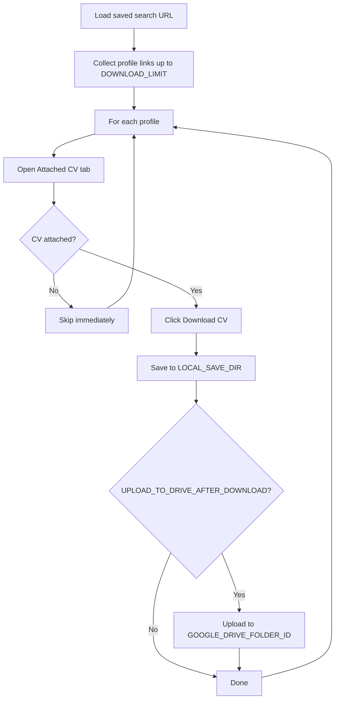

# Naukri Resdex bulk download

Playwright automation for **Naukri Recruiter / Resdex**: browser login, session reuse, bulk CV download from saved searches, and optional **Google Drive upload** after each file is saved locally.

Used in two ways:

1. **Standalone CLI** — run from terminal for local downloads
2. **Via portal** — `fetch-cvs-server` spawns this module when you click **Fetch CVs & Rank** on the Naukri tab

---

## How it works



1. Reuses `sessions/storageState.json` after first login (`npm run login`).
2. Opens each profile with `tabKey=videoAndCv`.
3. Opens **Attached CV** and runs a fast check (`src/resdex/detectAttachedCv.ts`):
   - Empty messages (“no CV attached”, etc.), or
   - No **Download CV** / **View CV** controls → status `skipped`, next profile.
4. Clicks **Download CV** and saves to `LOCAL_SAVE_DIR`.
5. If Drive upload is enabled, uploads via `src/drive/uploadAfterDownload.ts`.

### Result statuses

| Status | Meaning |
|--------|---------|
| `skipped` | No attached CV — profile skipped quickly |
| `clicked` | Download step ran; file may be local only |
| `uploaded` | Local file + Drive upload succeeded |
| `failed` | Error (login, selectors, captcha, etc.) |

---

## Setup

### Prerequisites

- Node.js 18+
- Naukri Recruiter account with Resdex access
- Google OAuth credentials (only if uploading to Drive)

### Install

```bash
cd bulk-download
npm install
```

Playwright Chromium is installed via `postinstall`.

### Environment

**All config lives in the repo root** — not in `bulk-download/.env`.

```bash
# from ats-perfect-ventures/
cp .env.example .env.local
```

Edit `.env.local` (or `.env`). Both files are loaded; `.env.local` wins.

#### Required

| Variable | Description |
|----------|-------------|
| `NAUKRI_USERNAME` | Recruiter email |
| `NAUKRI_PASSWORD` | Password |
| `RESDEX_SAVED_SEARCH_URL` | Resdex saved search URL (for standalone runs) |
| `DOWNLOAD_LIMIT` | Max profiles per run (e.g. `30`) |
| `HEADLESS` | `false` recommended — Resdex often needs a visible browser |

#### Download & local save

| Variable | Description |
|----------|-------------|
| `MANUAL_DOWNLOAD_SAVE` | `true` = capture download to disk (default `true`) |
| `LOCAL_SAVE_DIR` | Folder for saved CVs (e.g. `D:\Resumes\Naukri`) |
| `NAUKRI_LOCAL_SAVE_DIR` | Alias for `LOCAL_SAVE_DIR` |
| `MANUAL_DOWNLOAD_PAUSE_MS` | Pause between profiles in ms (default `3000`) |
| `SESSION_DIR` | Session storage folder (default `sessions`) |
| `NAUKRI_SESSION_DIR` | Alias for `SESSION_DIR` |

#### Google Drive (optional)

| Variable | Description |
|----------|-------------|
| `UPLOAD_TO_DRIVE_AFTER_DOWNLOAD` | `true` to upload each file after download |
| `GOOGLE_DRIVE_FOLDER_ID` | Target Drive folder ID |
| `GOOGLE_AUTH_MODE` | `oauth` or `service_account` |
| `GOOGLE_OAUTH_CLIENT_ID` / `GOOGLE_OAUTH_CLIENT_SECRET` | OAuth app credentials |
| `GOOGLE_OAUTH_TOKEN_FILE` | Token path after `npm run google-oauth-setup` |

When triggered from the **portal**, `fetch-cvs-server` overrides `RESDEX_SAVED_SEARCH_URL`, `DOWNLOAD_LIMIT`, and `GOOGLE_DRIVE_FOLDER_ID` for each job.

---

## Commands

Run from **`bulk-download/`**:

| Script | Description |
|--------|-------------|
| `npm run login` | Browser login → saves `sessions/storageState.json` |
| `npm run download-resdex` | Bulk download from `RESDEX_SAVED_SEARCH_URL` |
| `npm run google-oauth-setup` | One-time Google Drive OAuth (CLI uploads) |
| `npm run test-api` | Session + recruiter API smoke test |
| `npm run scan` | Scan profile links from saved search |
| `npm run download` | Download from scanned profile list |
| `npm run build` | Compile TypeScript |

Run from **repo root**:

```bash
npm run bulk-download
```

Equivalent to `npm run download-resdex` inside `bulk-download/`.

---

## First run

```bash
# 1. Set NAUKRI_USERNAME, NAUKRI_PASSWORD, RESDEX_SAVED_SEARCH_URL in .env.local

# 2. Login once (visible browser — complete captcha if prompted)
cd bulk-download
npm run login

# 3. Download
npm run download-resdex
```

For Drive upload:

```bash
npm run google-oauth-setup   # once
# Set UPLOAD_TO_DRIVE_AFTER_DOWNLOAD=true and GOOGLE_DRIVE_FOLDER_ID
npm run download-resdex
```

---

## Portal integration

When you use **Upload Resumes → Naukri** in the portal:

1. `fetch-cvs-server` must be running (`npm run fetch-cvs-server` from repo root).
2. Google Drive must be connected in the portal header.
3. The JD must have a Drive folder (created when saving the JD).
4. The server runs `npm run download-resdex` with:
   - `RESDEX_SAVED_SEARCH_URL` = URL you pasted
   - `DOWNLOAD_LIMIT` = count you entered
   - `GOOGLE_DRIVE_FOLDER_ID` = JD's `naukri` subfolder
   - `UPLOAD_TO_DRIVE_AFTER_DOWNLOAD=true`

After download completes, the portal ranks CVs from that Drive folder.

---

## Project structure

```
bulk-download/
├── src/
│   ├── config/          # Env loading (reads repo root .env)
│   ├── auth/            # Naukri login
│   ├── browser/         # Launcher, manual download helpers
│   ├── session/         # Storage state, validation
│   ├── resdex/          # Profile links, download, CV detection
│   ├── drive/           # Google Drive OAuth + upload
│   ├── api/             # Recruiter API smoke tests
│   ├── utils/
│   └── scripts/         # CLI entry points
├── sessions/            # storageState, downloads (gitignored)
├── logs/
└── package.json
```

---

## Troubleshooting

### `NAUKRI_USERNAME` / password errors

Set credentials in **repo root** `.env.local`, not in `bulk-download/`.

### Only N profiles when LIMIT is higher

Confirm `DOWNLOAD_LIMIT` is uncommented in `.env.local`. Check logs for `downloadLimit` and `Profile links collected`.

### Login / captcha

Use `HEADLESS=false`, complete captcha manually, re-run `npm run login`.

### Skipped too many profiles

Run with a visible browser and confirm Attached CV shows **Download CV**. Update patterns in `src/resdex/detectAttachedCv.ts` if Naukri UI changed.

### No file saved locally

Automation captures downloads to `LOCAL_SAVE_DIR` — it does not rely on Chrome “Save As”. Ensure `MANUAL_DOWNLOAD_SAVE=true`.

### Drive upload fails

Re-run `npm run google-oauth-setup`. Local files remain in `LOCAL_SAVE_DIR`.

For portal fetch, prefer **Connect Drive** in the portal header (Supabase OAuth) over CLI OAuth — the fetch server passes a folder ID per job.

### Logs

- `logs/naukri-automation.log`
- `logs/error.log`

---

## Security

- Do not commit `.env.local` or `sessions/storageState.json`
- Session files are credential-equivalent
- Use in compliance with Naukri terms of service

## License

Private — internal use for ATS Perfect Ventures.
